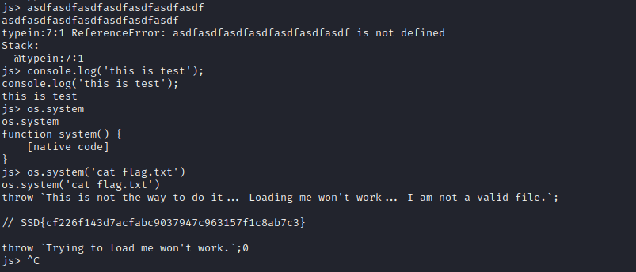

# Challenge
Someone has left a beta version of Spidermonkey on. It looks like it’s based on commit c1598f6d3edad19ccc53f53ab045d1d29835e1dd and has a brand new beta patch added to it.

Please reference repo: https://github.com/mozilla/gecko-dev/commit/c1598f6d3edad19ccc53f53ab045d1d29835e1dd

Are you able to find a vulnerability and exploit it?

nc --ssl typhooncon-see-you-later-allocator.chals.io 443

Flag format: SSD{...}

## Solution \[MasterWard\]
Started with some research where we got to a page https://105423.com/p/firefox/comments/s96eav/firefox_compatibility_and_support_for_kde/ from the commit hash. It said a lot about dark mode and a couple of other things. 
I didn't get anything from it so just jumped into the connection to see what I could figure out. After a few commands I figured out the solution was semi simple by reading the flag.txt file.
ran the command os.system('cat flag.txt') in the debugger shell and that printed out the flag in a comment.
